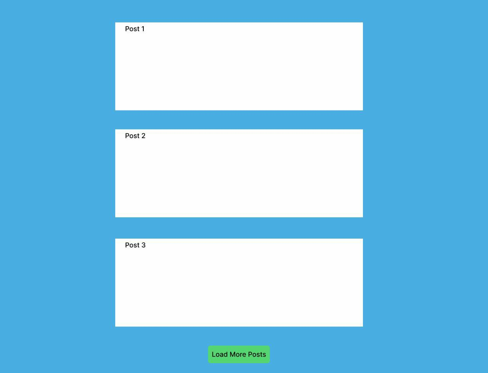

# Red Collar Frontend School 2023, Homework №4. Browser API.

Необходимо реализовать пагинацию используя `fetch` и `intersection observer`. Для этого можете использовать готовые данные с https://dummyjson.com/, это аналог jsonplaceholder. Там есть методы как раз для пагинации постов и юзеров (например, пункт Limit & Skip Users).

Дизайн на ваше усмотрение, но настоятельно рекомендую использовать scss.

Тригером для обзёрвера может служить как кнопка, так и скрытый элемент после списка, это уже как вам удобнее.

Прототип:

